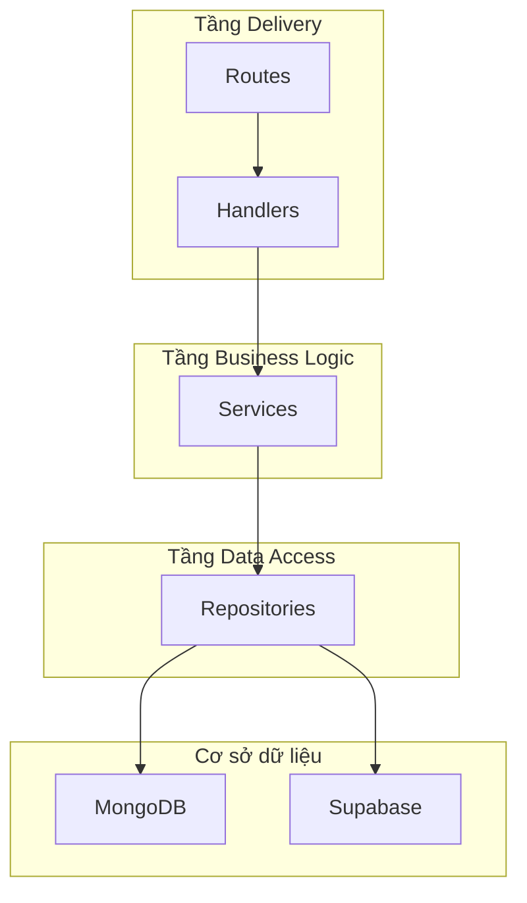

# Tài liệu Thiết kế Kỹ thuật - Dự án TZone

**Tác giả:** Trợ lý AI

**Ngày tạo:** 26/01/2026

**Phiên bản:** 1.0

---

## 1. Giới thiệu

Tài liệu này mô tả chi tiết về thiết kế kỹ thuật của dự án **TZone**. TZone là một ứng dụng web backend được xây dựng bằng ngôn ngữ Go, có chức năng chính là cung cấp thông tin về các thiết bị di động. Dự án áp dụng kiến trúc phân lớp (Layered Architecture) để đảm bảo tính module hóa, dễ bảo trì và mở rộng.

## 2. Mục tiêu

- **Xây dựng hệ thống backend:** Cung cấp các API để quản lý và truy xuất thông tin về điện thoại (thương hiệu, thiết bị, thông số kỹ thuật).
- **Giao diện web (Frontend):** Xây dựng một trang web đơn giản để hiển thị thông tin sản phẩm, mô phỏng theo trang GSMArena.
- **Kiến trúc linh hoạt:** Thiết kế hệ thống cho phép dễ dàng tích hợp với nhiều nguồn dữ liệu khác nhau (MongoDB, Supabase) và mở rộng các tính năng trong tương lai.
- **Hiệu năng cao:** Tận dụng hiệu năng của Go và Gin framework để xử lý các yêu cầu một cách nhanh chóng.

## 3. Tổng quan về Kiến trúc

Dự án được xây dựng theo kiến trúc phân lớp (Layered Architecture), chia thành các tầng logic riêng biệt. Luồng xử lý một yêu cầu (request) sẽ đi từ tầng **Delivery** (Routes, Handlers) xuống tầng **Service** (Business Logic) và cuối cùng là tầng **Repository** (Data Access).

### Cấu trúc thư mục chính:

- **`/cmd`**: Điểm khởi đầu (entry point) của ứng dụng. Chứa hàm `main()` để khởi tạo và chạy server.
- **`/internal`**: Chứa toàn bộ mã nguồn chính của ứng dụng, được phân chia theo các tầng kiến trúc.
    - **`/delivery`**: Tầng giao tiếp với bên ngoài (HTTP).
        - **`/handler`**: Xử lý logic của các HTTP request, nhận dữ liệu từ client, gọi service tương ứng và trả về response.
        - **`/route`**: Định nghĩa các endpoint (đường dẫn) và liên kết chúng với các handler.
    - **`/service`**: Tầng chứa logic nghiệp vụ (business logic) của ứng dụng. Tầng này không phụ thuộc vào cách dữ liệu được lưu trữ hay cách chúng được trình bày.
    - **`/repository`**: Tầng truy cập dữ liệu, chịu trách nhiệm giao tiếp với cơ sở dữ liệu (MongoDB, Supabase). Cung cấp các phương thức để CRUD (Create, Read, Update, Delete) dữ liệu.
    - **`/model`**: Định nghĩa các cấu trúc dữ liệu (struct) chính của ứng dụng, đại diện cho các thực thể như `Device`, `Brand`.
    - **`/server`**: Chứa mã nguồn để thiết lập và quản lý server (Gin Engine), bao gồm cả việc liên kết các tầng lại với nhau (dependency injection).
- **`/infrastructure`**: Chứa các thành phần hạ tầng, hỗ trợ cho ứng dụng.
    - **`/configuration`**: Xử lý việc tải và xác thực các biến môi trường.
    - **`/database`**: Cung cấp các hàm để kết nối, ping và đóng kết nối tới các cơ sở dữ liệu.
- **`/web`**: Chứa mã nguồn cho phần frontend, được render phía server bằng thư viện Gomponents.
    - **`/page`**: Định nghĩa các trang (ví dụ: `HomePage`) và các thành phần con (components) của trang.
        - **`/shared`**: Chứa các thành phần được tái sử dụng trên nhiều trang như `Header`, `Footer`, `Layout`.
- **`/docs`**: Chứa các tài liệu của dự án, bao gồm cả tài liệu này.

## 4. Thiết kế Chi tiết các Tầng

### 4.1. Tầng Delivery

- **Framework:** [Gin Gonic](https://github.com/gin-gonic/gin) được sử dụng làm web framework chính nhờ hiệu năng cao và API đơn giản.
- **Routing (`/internal/delivery/route`):**
    - Các file route được tách biệt theo từng domain (ví dụ: `device_route.go`, `brand_route.go`).
    - Mỗi file định nghĩa một hàm (ví dụ: `NewDeviceRoutes`) nhận vào `*gin.Engine` và handler tương ứng để đăng ký các endpoint.
    - **Ví dụ:** Endpoint `GET /devices/latest` được đăng ký trong `device_route.go` và trỏ tới `deviceHandler.GetLatestDevices`.
- **Handlers (`/internal/delivery/handler`):**
    - Mỗi handler chịu trách nhiệm cho một nhóm chức năng (ví dụ: `DeviceHandler`).
    - Handler nhận `gin.Context`, trích xuất dữ liệu từ request (query parameters, request body), gọi đến `Service` để xử lý nghiệp vụ.
    - Sau khi nhận kết quả từ `Service`, handler sẽ định dạng và trả về response cho client (thường là JSON).
    - **Ví dụ:** `DeviceHandler.GetLatestDevices` lấy tham số `limit` từ query, gọi `deviceService.GetLatestDevices` và trả về danh sách thiết bị dưới dạng JSON.

### 4.2. Tầng Service

- **Mục đích:** Tách biệt logic nghiệp vụ khỏi các chi tiết về giao thức và lưu trữ.
- **Thiết kế (`/internal/service`):**
    - Mỗi service tương ứng với một domain (ví dụ: `DeviceService`).
    - Service được định nghĩa qua một `interface`, giúp cho việc testing và thay đổi implementation trở nên dễ dàng.
    - Service nhận vào `Repository` thông qua dependency injection.
    - **Ví dụ:** `deviceService` có phương thức `GetLatestDevices`, phương thức này sẽ gọi `deviceRepository.FindLatest` để lấy dữ liệu từ database.

### 4.3. Tầng Repository

- **Mục đích:** Trừu tượng hóa việc truy cập cơ sở dữ liệu. Tầng `Service` chỉ cần biết "lấy dữ liệu" mà không cần quan tâm dữ liệu đó đến từ MongoDB, PostgreSQL hay một API khác.
- **Thiết kế (`/internal/repository`):**
    - Tương tự `Service`, mỗi repository cũng được định nghĩa qua một `interface` (ví dụ: `DeviceRepository`).
    - Implementation cụ thể cho từng loại database sẽ được tạo (ví dụ: `deviceRepository` cho MongoDB).
    - Sử dụng driver chính thức của MongoDB cho Go (`go.mongodb.org/mongo-driver`) để thực hiện các truy vấn.
    - **Ví dụ:** `deviceRepository.FindLatest` sử dụng `collection.Find()` với các tùy chọn sắp xếp (`sort`) theo ngày công bố và giới hạn (`limit`) số lượng kết quả.

### 4.4. Tầng Frontend (Server-Side Rendering)

- **Thư viện:** [Gomponents](https://www.gomponents.com/) được sử dụng để viết mã HTML bằng Go một cách an toàn và có cấu trúc.
- **Thiết kế (`/web/page`):**
    - **`layout.go`**: Định nghĩa cấu trúc layout chung của trang web (`BaseLayout`), bao gồm thẻ `<html>`, `<head>`, `<body>`, và các file CSS, JS chung. Nó cũng nhúng `Header` và `Footer`.
    - **`header.go`, `footer.go`**: Các thành phần chung được tách ra để dễ quản lý và tái sử dụng.
    - **`index.go`**: Định nghĩa nội dung chính của trang chủ. Trang này được chia thành nhiều component con (`SubHeader`, `MainContent`, `Sidebar`,...) để tăng tính rõ ràng và dễ bảo trì.
    - **Luồng render:** Khi một request đến endpoint của trang web, handler sẽ gọi hàm render chính (ví dụ: `HomePage`), hàm này sẽ gọi `BaseLayout` và truyền vào nội dung cụ thể của trang đó.

## 5. Luồng Dữ liệu và Xử lý

### Luồng xử lý API `GET /devices/latest`:

1.  **Request:** Client gửi yêu cầu `GET` đến `/devices/latest?limit=5`.
2.  **Routing:** Gin Engine nhận request, tìm thấy route đã đăng ký và chuyển đến `deviceHandler.GetLatestDevices`.
3.  **Handler:**
    - `deviceHandler` đọc giá trị `limit` từ query string (mặc định là 10).
    - Gọi `deviceService.GetLatestDevices(ctx, 5)`.
4.  **Service:**
    - `deviceService` nhận yêu cầu và gọi `deviceRepository.FindLatest(ctx, 5)`.
5.  **Repository:**
    - `deviceRepository` tạo một truy vấn MongoDB để tìm các document trong collection `devices`.
    - Truy vấn được sắp xếp theo trường `specifications.Launch.Announced` giảm dần và giới hạn 5 kết quả.
    - Thực thi truy vấn và decode kết quả vào một slice `[]model.Device`.
6.  **Response:**
    - Dữ liệu được trả về qua các tầng: Repository -> Service -> Handler.
    - Handler nhận slice `[]model.Device`, serialize nó thành JSON và gửi về cho client với status code `200 OK`.

## 6. Thiết lập và Cấu hình

- **Configuration (`/infrastructure/configuration`):**
    - Sử dụng thư viện `godotenv` để tải các biến môi trường từ file `.env`.
    - Một struct `Config` được định nghĩa để chứa tất cả các cấu hình của ứng dụng (server port, database URIs, keys,...).
    - Có hàm `Validate()` để kiểm tra các cấu hình thiết yếu trước khi khởi động server.
- **Database (`/infrastructure/database`):**
    - Cung cấp các hàm `Connect`, `Ping`, `Close` cho MongoDB.
    - Cung cấp hàm `ConnectSupabase` cho Supabase.
    - Việc khởi tạo kết nối được thực hiện trong hàm `main()` và các client (MongoDB, Supabase) được truyền vào `Server` instance.

## 7. Kết luận

Thiết kế hiện tại của dự án TZone tuân thủ các nguyên tắc của kiến trúc phần mềm hiện đại, giúp dự án có nền tảng vững chắc để phát triển. Việc phân tách rõ ràng các tầng trách nhiệm, sử dụng interface và dependency injection giúp mã nguồn trở nên linh hoạt, dễ kiểm thử và mở rộng. Phần frontend được render phía server bằng Gomponents cũng là một lựa chọn thú vị, giúp xây dựng giao diện nhanh chóng mà không cần đến một framework JavaScript phức tạp.
